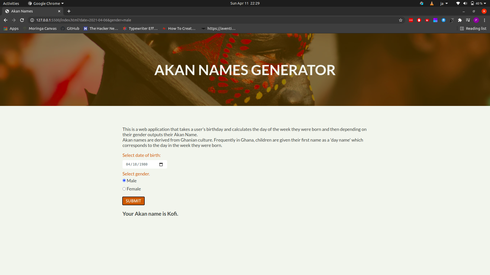

# Akan Names Generator
#### A simple web application to determine Akan name, 2021.
#### By **Peter Kennedy**
## Description
This is a web application that takes a user's birthday and calculates the day of the week they were born and then depending on their gender outputs their Akan Name.
Akan names are derived from Ghanian culture. Frequently in Ghana, children are given their first name as a 'day name' which corresponds to the day in the week they were born.

## Setup/Installation
- To view the website, go to [peterken674.github.io/akan-names](https://peterken674.github.io/akan-names). 
- Select your date of birth.
- Select you gender.
- Click "Submit" to get your Akan name generated.
## Known Bugs
- No knowns bugs so far, but you can reach out if any is observed.
## Technologies Used
- HTML
- CSS
- JavaScript
## Support and contact details
If you have any suggestions, questions or in case of a fire, you can reach the developer via [email](mailto:peterken.ngugi@gmail.com).
### License
 

Copyright &copy; 2021 **[peterken674](www.github.com/peterken674)**